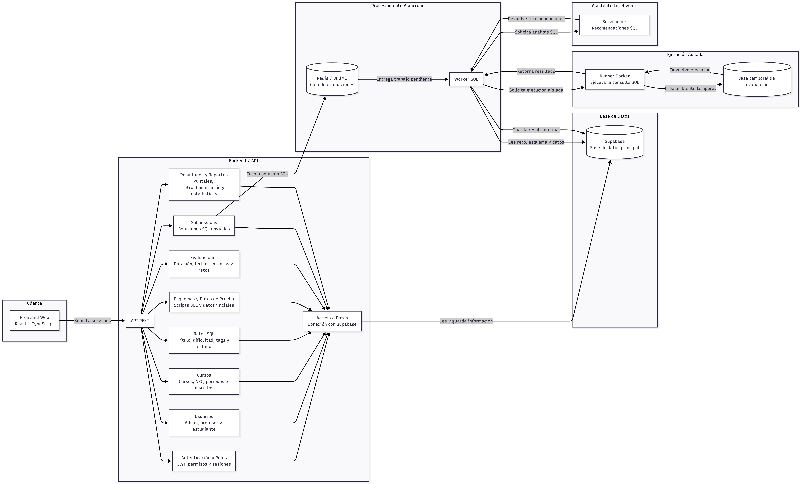

# Diagrama de Componentes 

El siguiente diagrama representa los principales componentes de la plataforma **SQLIA** y la forma en que se comunican entre sí.

## Diagrama de componentes

  

El diagrama muestra cómo está dividido el sistema en componentes principales.  
El **Frontend Web** es el componente con el que interactúan los usuarios. Desde allí se envían solicitudes hacia la **API REST**, que funciona como punto de entrada al backend.

Dentro del **Backend/API** se encuentran los componentes encargados de manejar las funcionalidades principales del sistema, como autenticación, usuarios, cursos, retos SQL, evaluaciones, submissions, resultados y reportes.

Los componentes del backend se comunican con el componente de **Acceso a Datos**, que centraliza la conexión con **Supabase**, usado como base de datos principal del sistema.

## Componentes del sistema

| Componente | Descripción |
|---|---|
| **Frontend Web** | Interfaz del sistema desarrollada con React y TypeScript. Permite a los usuarios interactuar con la plataforma. |
| **API REST** | Punto de entrada del backend. Recibe las solicitudes del frontend y las dirige al componente correspondiente. |
| **Autenticación y Roles** | Gestiona JWT, permisos, sesiones y acceso según el rol del usuario. |
| **Usuarios** | Administra la información de administradores, profesores y estudiantes. |
| **Cursos** | Gestiona cursos, NRC, periodos académicos y estudiantes inscritos. |
| **Retos SQL** | Permite crear y administrar retos SQL con título, dificultad, etiquetas y estado. |
| **Esquemas y Datos de Prueba** | Maneja los scripts SQL, esquemas de base de datos y datos iniciales para los retos. |
| **Evaluaciones** | Administra evaluaciones, duración, fechas, intentos y retos asociados. |
| **Submissions** | Registra las soluciones SQL enviadas por los estudiantes. |
| **Resultados y Reportes** | Gestiona puntajes, retroalimentación, estadísticas y reportes. |
| **Acceso a Datos** | Centraliza la comunicación entre los módulos del backend y Supabase. |
| **Supabase** | Base de datos principal donde se almacena la información del sistema. |
| **Redis / BullMQ** | Cola de evaluaciones usada para procesar submissions de forma asíncrona. |
| **Worker SQL** | Procesa las soluciones pendientes, coordina la ejecución y guarda los resultados. |
| **Runner Docker** | Ejecuta las consultas SQL en un ambiente aislado. |
| **Base Temporal de Evaluación** | Base usada temporalmente para ejecutar las consultas sin afectar la base principal. |
| **Servicio de Recomendaciones SQL** | Genera sugerencias de optimización y retroalimentación sobre las consultas enviadas. |

