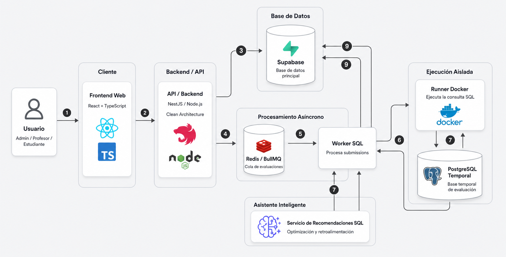

# Diseño de Arquitectura 

El siguiente diagrama representa la arquitectura general de la plataforma **SQLIA**, mostrando cómo interactúan las principales tecnologías, servicios y capas del sistema.


<p align="center">
  
</p>


La arquitectura de la plataforma **SQLIA** está organizada en varios bloques principales. 

Cada bloque representa una parte tecnológica importante del sistema y cumple una responsabilidad específica dentro del flujo de evaluación automática de consultas SQL.

El usuario puede ser **administrador**, **profesor** o **estudiante**. Desde el **Frontend Web**, desarrollado con **React y TypeScript**, el usuario interactúa con las funcionalidades de la plataforma, como iniciar sesión, consultar cursos, resolver retos SQL, enviar soluciones, revisar resultados y consultar reportes.

El frontend se comunica con el **Backend/API**, desarrollado con **NestJS y Node.js**, donde se aplican las reglas principales del sistema. El backend está organizado siguiendo los principios de **Clean Architecture**, separando la lógica del negocio, los casos de uso, los controladores y el acceso a datos.

## Organización general del proyecto

El proyecto **SQLIA** está organizado en una estructura donde el **backend principal** se encuentra en la raíz del proyecto y el **frontend** está separado en su propia carpeta.

La estructura general observada en el proyecto es la siguiente:

```text
SQLIA/
│
├── docs/
│   └── Documentación del proyecto, diagramas y archivos explicativos
│
├── frontend/
│   └── Aplicación web desarrollada con React + TypeScript
│
├── src/
│   └── Código fuente principal del backend en NestJS
│
├── prisma/
│   └── Configuración relacionada con Prisma y el modelo de datos
│
├── test/
│   └── Pruebas del backend
│
├── dist/
│   └── Archivos compilados del backend
│
└── .db-data/
  └── Datos persistentes del contenedor de base de datos en entorno local